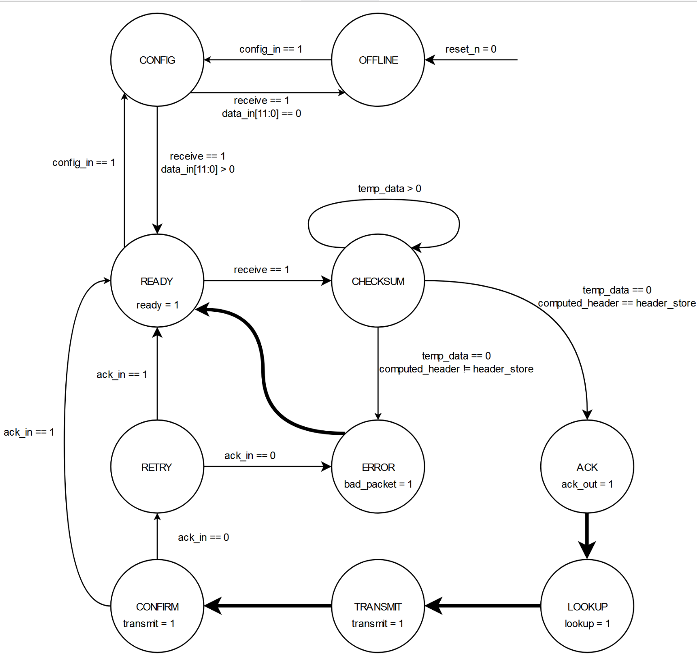
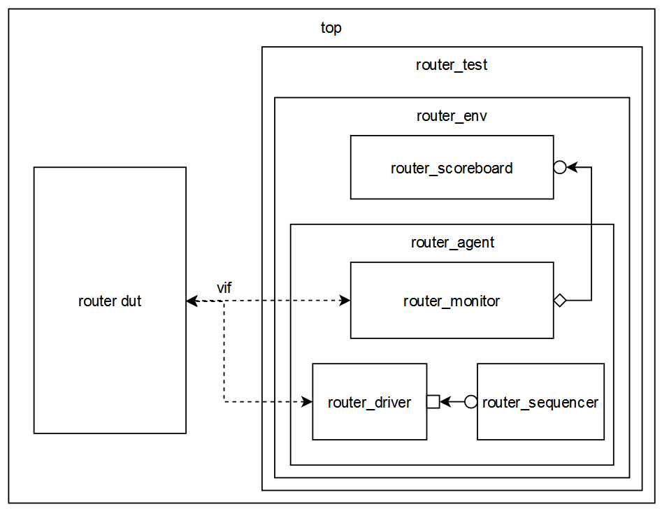
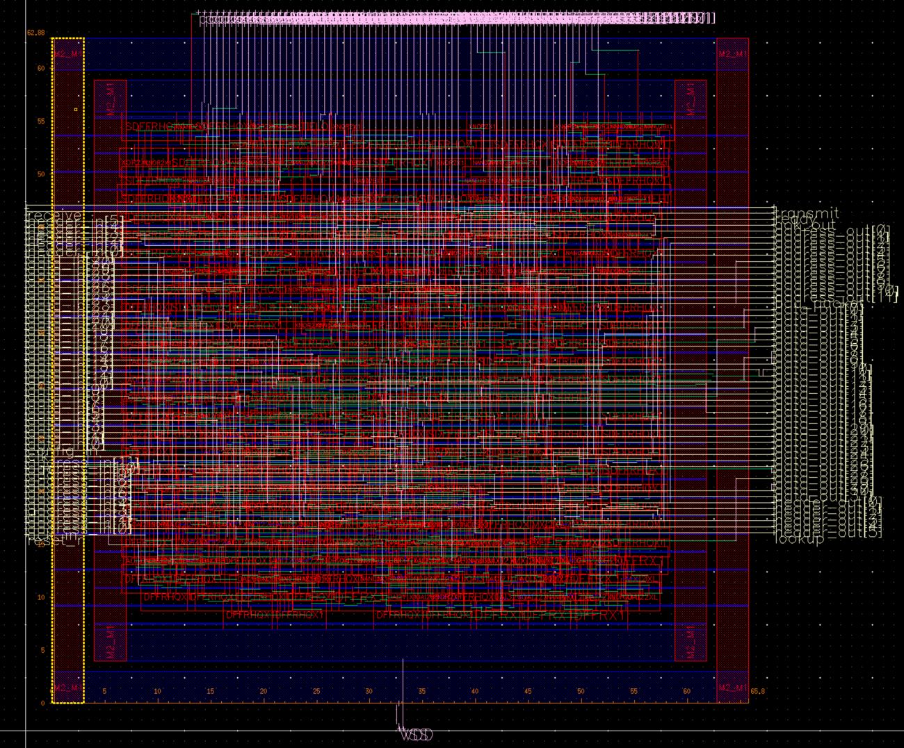
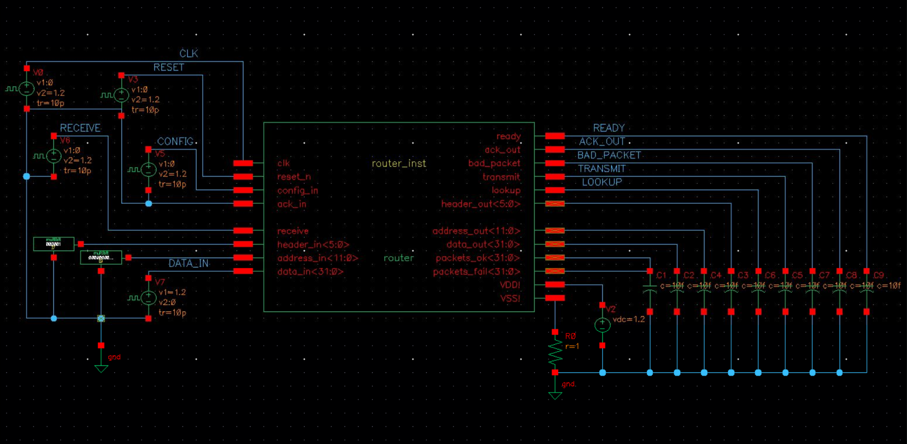
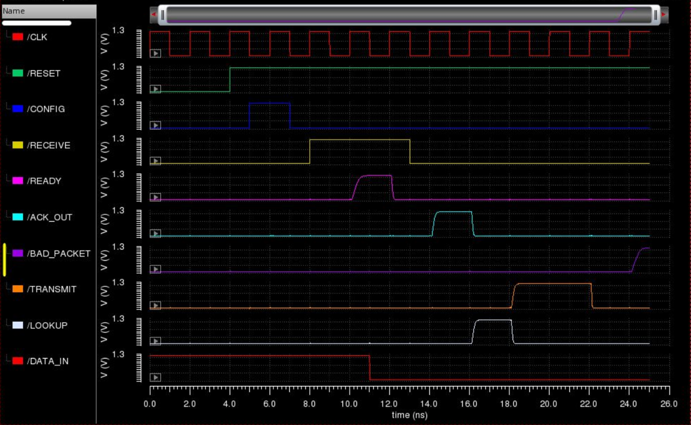

# Router ASIC: Design, Verification, and Layout
This repo contains the SystemVerilog HDL code for simple router. The router design has the following components:
- FSM design
- UVM testbench for constrained random verification
- Synthesized netlist using Cadence RC
- Layout using Cadence Innovus for a 45nm technology node
- SPICE netlist and gate-level simulation with all parasitic capacitances using Cadence Virtuoso

## Design
This is an implementation of a simple router (or packet switch). At a high-level, the router does the following:
-	Receive own address from ISP/service provider
-	Receive packets
-	Check if the packet is valid by matching checksum to header
-	Follows simple acknowledgement protocols
-	Lookup the destination address
-	Try to send the packet data to the new address
-	Keep count of the # of good and bad packets

The router computes checksum by counting the # of 1s in the 32-bit packet data. It then compares this computed checksum to the input header
This FSM Diagram shows the states of the router.

## UVM Testbench
The UVM testbench tests the router using randomly generated data packets. Specifically, the test looks at how the router responds to valid and invalid inputs.

## Synthesis and Layout
Synthesis is done using Cadence RC for a 45nm technology node. Overall, there are no timing violations
The synthesized netlist is made into a layout using Cadence Innovus. Layout Characteristics:
- No DRC violations
- LVS clean
- 65.80 um wide and 62.88 um tall 

## Spice Extraction and Simulation
A SPICE netlist is extracted from the final layout. This netlist is used for SPICE simulation of the entire router design.
The SPICE simulation testbench is created in Cadence Virtuoso. The outputs drive 10fF load capacitances

This simulation encompasses all parasitic capacitances and shows actual signal transitions and delays for the main inputs/outputs.

